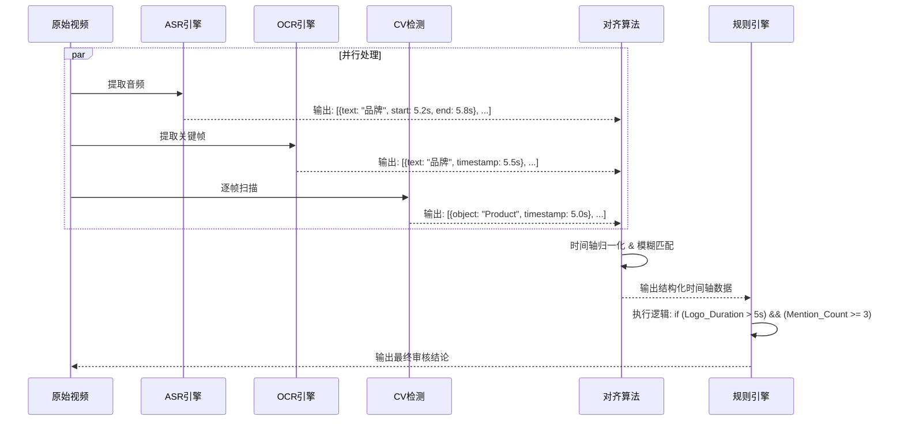

这是一个基于 `RequirementsDoc.md`、`FeatureSummary.md` (V1.4) 和 `User_Role_Interfaces.md` 编写的开发计划文档。

> **历史路线图说明**：本文档记录早期架构与排期假设。文中的 WebSocket、独立服务、对象存储扩容和未来容量规划不代表当前已交付实现；当前实现以 FastAPI + Next.js 单体应用、SSE、Celery/Redis、TOS/本地存储和源码测试为准。

这份文档旨在指导技术团队进行架构设计、选型和排期，重点在于解决**视频处理的高并发/高延迟**、**多模态 AI 的集成**以及**移动端适配**等工程难点。

文件名：`DevelopmentPlan.md`

---

# DevelopmentPlan.md - 智能视频审核系统开发计划

| 文档类型 | **Development Plan (技术架构与实施计划)** |
| --- | --- |
| **项目名称** | 内容卫士 AI 审核平台 (AI 营销内容合规审核平台) |
| **版本号** | V1.7 |
| **日期** | 2026-02-05 |
| **依据** | FeatureSummary V1.7, PRD V1.0, User_Role_Interfaces V1.6 |
| **侧重** | 技术选型、架构设计、MVP 范围、开发排期、验收标准 |

---

## 版本历史 (Version History)

| 版本 | 日期 | 作者 | 变更说明 |
| --- | --- | --- | --- |
| V1.0 | 2026-02-03 | Gemini | 初稿：技术架构、选型、排期 |
| V1.1 | 2026-02-03 | Claude | 审阅修订：补充 F-05-A/F-45 技术方案、验收标准、数据模型、测试策略 |
| V1.2 | 2026-02-03 | Claude | Reviewer 修正：Logo检测改向量检索、Brief解析增VLM、弹性GPU、H5防锁屏、排期调整 |
| V1.2.1 | 2026-02-03 | Claude | 补充多模态时间戳对齐流程图 (Gemini 建议) |
| V1.3 | 2026-02-03 | Claude | **确立 TDD 为项目核心开发规范**，关联 tdd_plan.md |
| V1.4 | 2026-02-03 | Claude | **新增 AI 厂商动态配置架构**，支持数据库配置、运行时热更新、多租户隔离 |
| V1.5 | 2026-02-03 | Claude | 文档一致性修复：统一加密方案、采样精度、处理时间、选型决策、P0 范围、排期等 |
| V1.6 | 2026-02-03 | Claude | 文档一致性修订：AI 配置单提供商模式、审计日志不可篡改方案、FeatureSummary 版本对齐 |
| V1.7 | 2026-02-05 | Claude | 更新依据文档版本（FeatureSummary V1.7），与两阶段审核流程对齐 |

---

## 1. 技术架构设计 (Architecture Design)

### 1.1 系统架构图 (逻辑视图)

采用 **前后端分离** + **AI 微服务化** 的架构，以应对视频处理的高算力需求和长尾延迟。

```mermaid
graph TD
    User[用户 (PC/Mobile)] -->|HTTPS| Gateway[API Gateway / Nginx]
    
    subgraph Frontend
        Web_PC[PC 审核台 (React/Next.js)]
        Web_H5[达人端 H5 (React/Next.js)]
    end
    
    subgraph Backend_Core [核心业务服务]
        API_Main[主业务 API (FastAPI)]
        Auth[认证服务]
        Workflow[工作流引擎]
        Upload_Svc[文件上传服务 (Tus协议)]
    end
    
    subgraph Async_Layer [异步处理层]
        Queue[消息队列 (Redis)]
        Worker_Manager[任务调度器 (Celery)]
        Socket_Svc[WebSocket 推送服务]
    end
    
    subgraph AI_Engine [AI 引擎集群]
        Svc_Parser[Brief 解析服务 (Layout+VLM+LLM)]
        Svc_NLP[脚本/语义分析 (LLM)]
        Svc_Video[视频多模态流水线]
        Svc_Logo[Logo 向量检索服务]
    end
    
    subgraph Storage
        DB[(PostgreSQL - 业务数据)]
        VectorDB[(pgvector - 知识库)]
        Cache[(Redis - 缓存/进度)]
        OSS[对象存储 (视频/图片)]
    end

    Gateway --> Web_PC
    Gateway --> Web_H5
    Web_PC --> API_Main
    Web_H5 --> API_Main
    API_Main --> DB
    API_Main --> Queue
    Worker_Manager --> Queue
    Worker_Manager --> Svc_Parser
    Worker_Manager --> Svc_NLP
    Worker_Manager --> Svc_Video
    Svc_Video --> OSS
    Socket_Svc <--> User

```

### 1.2 技术选型 (Tech Stack)

| 模块 | 选型建议 | 理由 (Why) |
| --- | --- | --- |
| **前端框架** | **Next.js (React)** + Tailwind CSS | 统一 PC 和 H5 代码库；Next.js 的 SSR 对 SEO 和首屏渲染友好；适合构建复杂的审核 Dashboard。 |
| **移动端** | **Responsive H5 + Wake Lock API** | 全角色（达人/代理商/品牌方）均通过 Next.js 响应式布局覆盖 iOS/Android 浏览器及微信内嵌浏览器，无需开发原生 App。⭐ V1.2 增加防锁屏策略。 |
| **后端 API** | **Python (FastAPI)** | Python 是 AI 原生语言，FastAPI 具有极高的并发性能（AsyncIO），方便集成 AI 模型 SDK。 |
| **异步队列** | **Celery + Redis** | 视频审核是典型长耗时任务（3-5分钟），必须异步处理。Celery 成熟稳定。 |
| **实时通讯** | **WebSocket (Socket.io)** | 必须实现（F-17），用于向前端实时推送“正在检测 Logo...”等细粒度进度。 |
| **数据库** | **PostgreSQL** + **pgvector** | PG 处理关系型数据，pgvector 插件直接在 PG 中处理向量搜索（竞品库/相似案例），减少架构复杂度。 |
| **文件存储** | **TOS / S3 兼容对象存储** | 视频文件大，需配合 CDN 或签名策略提供受控访问。 |
| **上传协议** | **Tus Protocol** (Uppy.js) | 解决大文件（≤ 100MB）上传不稳定问题，支持**断点续传**，替代 ZIP 上传。 |

### 1.3 AI 模型选型 (Model Selection)

| 任务 | 模型/服务选型 | 备注 |
| --- | --- | --- |
| **通用语义 (NLP)** | **豆包 Pro / Qwen-Max / DeepSeek** | 处理 Brief 解析、反讽识别、情感分析 |
| **视觉理解 (VLM)** | **Qwen-VL / 豆包视觉** | 处理复杂场景理解（如：环境脏乱差、具体动作判定）；**Brief 图片解析** |
| **语音识别 (ASR)** | **Whisper / Paraformer / SenseVoice** | 通过 AIProviderConfig 配置音频模型，支持时间戳对齐 |
| **文字识别 (OCR)** | **PaddleOCR v4** | 针对中文视频字幕优化，开源免费，轻量级 |
| **版面分析 (Layout)** | **PaddleOCR Layout / LayoutLMv3** | Brief PDF 版面分析，提取图文混排结构 |
| **竞品 Logo 检测** | **Grounding DINO + Vector DB** | ⭐ V1.2 修正：改为向量检索方案，见下方说明 |

> ⭐ **V1.3 重要更新 - AI 厂商动态配置：**
>
> 本系统采用**商业 SaaS 级别的 AI 厂商动态配置架构**，详见 [AIProviderConfig.md](./AIProviderConfig.md)。
>
> **核心特性：**
> - **数据库存储配置：** AI 厂商的 API Key、Base URL 等配置存储在数据库中，而非环境变量
> - **运行时动态加载：** 管理员可在后台配置**单一 AI 提供商**，系统运行时动态读取配置初始化客户端
> - **多租户隔离：** 不同品牌方可配置独立的 AI 提供商配置和配额
> - **热更新：** 配置变更即时生效，无需重启服务
> - **API Key 加密：** 使用 AES-256-GCM 加密存储敏感信息
> - **可切换：** 管理员可随时更换提供商（OneAPI/OpenRouter 或直连厂商）
>
> **支持的厂商类型：**
> - 国内厂商：DeepSeek、通义千问、豆包、智谱、Moonshot
> - 海外厂商：OpenAI、Anthropic（需注意合规）
> - 中转服务：OneAPI、OpenRouter
> - 本地部署：Ollama、vLLM

> ⚠️ **V1.2 重要修正 - Logo 检测架构变更：**
>
> **废弃方案：** ~~YOLOv8 Fine-tuning~~
>
> **新方案：Embedding-based Retrieval (向量检索)**
> ```
> 1. 品牌方上传竞品 Logo 图片
> 2. Grounding DINO 提取 Logo 区域 → CLIP/DINOv2 生成 Embedding
> 3. 存入 Vector DB (pgvector)
> 4. 视频帧检测时：提取候选区域 → 生成 Embedding → 向量相似度匹配
> ```
>
> **优势：** 支持 SaaS 模式下品牌**动态添加竞品 Logo**，无需重新训练模型，**即刻生效**。

> ⚠️ **数据合规说明：** 根据 PRD 第 10 章"数据本地化"要求，国内客户数据原则上存储于中国大陆境内；若涉及跨境处理，需用户明示同意并符合监管要求。因此：
> - 生产环境允许国内/海外厂商（可通过 OneAPI/OpenRouter 等中转统一接入），但涉及境外处理需完成合规评估与客户授权
> - 若无法满足出境合规要求，则仅允许使用国内模型
> - ASR/OCR/CV 同样需满足对应合规与数据本地化要求

---

## 2. 关键技术难点与解决方案

### 2.1 难点：视频上传与解压风险 (F-30)

* **风险：** 传统表单上传大视频会导致超时；ZIP 解压消耗大量 CPU。
* **方案：**
1. **废弃 ZIP：** 前端采用 Uppy.js 实现**多文件并发上传**。
2. **分片上传：** 使用 Tus 协议，将 ≤ 100MB 视频切分为 5MB 的 chunk 上传，服务端合并。
3. **直传对象存储：** 前端获取短期签名直传，不经过应用服务器，节省带宽。

### 2.1.1 难点：H5 移动端上传中断 ⭐ V1.2 新增

* **风险：** iOS Safari 在屏幕锁定或切换后台时会杀死网络请求进程，导致大文件上传中断。
* **方案：**
1. **Wake Lock API：** 在上传期间请求屏幕常亮锁，防止系统休眠。
   ```javascript
   const wakeLock = await navigator.wakeLock.request('screen');
   ```
2. **UI 防锁屏提示：** 上传开始时显示醒目提示："⚠️ 上传中请保持屏幕常亮，切勿锁屏或切换应用"
3. **断点续传兜底：** Tus 协议支持断点续传，即使中断也可从断点恢复。
4. **兼容性处理：** Wake Lock API 在部分旧浏览器不支持，需做 Feature Detection 并提供降级提示。


### 2.2 难点：长时任务的用户焦虑 (F-17)

* **风险：** 视频分析需 3-5 分钟，用户易关闭页面。
* **方案：** **精细化 WebSocket 推送**。
* 后端 Worker 每完成一个子步骤（如 OCR 完成、ASR 完成），即向 Redis 写入状态。
* Socket 服务订阅 Redis，推送到前端：“✅ 字幕提取完成 (30%)” -> “👁️ Logo 检测中...”。


### 2.3 难点：语境理解与误报控制 (F-09)

* **风险：** 将"最开心"误判为广告法违规。
* **方案：** **两段式 AI 分析**。
1. **Segment（切片）：** 先让 AI 判断当前时间段是"剧情"还是"植入"。
2. **Evaluate（执法）：** 如果是"剧情"，应用宽松 Prompt；如果是"植入"，应用严格 Prompt。

### 2.4 难点：时长与频次校验 (F-45) ⭐ 新增

* **场景：** Brief 要求"产品同框 > 5秒"、"口播提及品牌名 ≥ 3次"。
* **技术挑战：** 需要将 ASR/CV 的时间戳信息转化为可统计的结构化数据。
* **方案：**

**频次统计（口播提及）：**
1. ASR 输出带时间戳的逐字稀疏文本：`[00:05.2] 这款 [00:05.8] 产品 [00:06.1] 真的很好用`
2. NLP 识别"品牌词/产品词"并统计出现次数
3. 输出：`品牌名提及 4 次 @ [00:05, 00:32, 01:15, 02:08]`

**时长统计（产品同框）：**
1. CV 模型逐帧检测"产品出现"（采样率：2fps 即可）
2. 合并连续出现的帧为"片段"：`产品出现 @ [00:10-00:18], [01:05-01:12]`
3. 累加总时长：`产品同框总时长 = 8s + 7s = 15s`

**验收标准：**
- 时长统计误差 ≤ 1秒
- 频次统计准确率 ≥ 95%

### 2.5 多模态时间戳对齐流程 ⭐ V1.2 补充

> 这是 Phase 2 延长 1 周的核心原因：ASR/OCR/CV 的时间轴需要精确同步。



**对齐算法要点：**
1. **时间轴归一化：** 将 ASR (毫秒级) / OCR (帧级) / CV (帧级) 统一为秒级时间戳
2. **模糊匹配窗口：** 允许 ±0.5s 的时间容差，解决各模态时间戳微小偏差
3. **事件合并：** 将同一时间窗口内的多模态事件合并为"复合事件"

---

## 3. MVP (P0) 开发范围定义

基于 `FeatureSummary.md V1.4`，MVP 阶段必须包含的功能：

### ✅ MVP 包含 (Must Have) - 共 21 个 P0 功能

基于 `FeatureSummary.md V1.4` 第 4.1 章定义：

| 模块 | 功能编号 | 功能名称 | 备注 |
| --- | --- | --- | --- |
| **Brief 管理** | F-01 | Brief 文档上传与解析 | |
| | F-02 | 在线文档链接导入 | |
| | F-03 | 平台规则库自动加载 | 平台规则变更 ≤ 1 工作日同步 |
| | F-04 | 区域合规规则切换 | |
| | **F-05-A** | **基础黑白名单与竞品库** | ⭐ MVP 必须能防竞品 |
| **脚本预审** | F-07 | 文本脚本提交与预审 | |
| | F-08 | 违规检测与修改建议 | |
| | **F-09** | **语境理解降低误报** | ⭐ P1→P0，避免"人工智障" |
| **视频审核** | F-10 | 视频上传 | |
| | F-11 | 多模态联合检测 | ASR/OCR/CV |
| | F-12 | 竞品 Logo 检测 | |
| | F-13 | 违禁词口播检测 | |
| | F-14 | 时间戳风险标注 | |
| | **F-45** | **时长与频次校验** | ⭐ 新增，Brief 硬指标 |
| | **F-17** | **审核进度实时展示** | ⭐ P1→P0，缓解等待焦虑 |
| **审核台** | F-19 | 风险列表展示 | |
| | F-20 | 确认/驳回操作 | |
| **数据看板** | F-33 | 核心指标卡片 | |
| **AI 配置** | **F-47** | **AI 服务商动态配置** | ⭐ V1.4 新增 |
| | **F-48** | **AI 服务商连通性测试** | ⭐ V1.4 新增 |
| | **F-49** | **多租户 AI 配置隔离** | ⭐ V1.4 新增 |

### ❌ MVP 暂不包含 (Post-MVP)

1. 高级豁免规则 (F-05-B)。
2. 版本比对 Diff 视图 (F-28)。
3. 批量操作 (F-30 批量审核/导出)。
4. 舆情监控中心 (F-41)。
5. AI 闭环训练系统 (F-46)。

---

## 4. 开发周期规划 (Roadmap)

假设配置：1 PM, 1 UI/UX, 2 Frontend, 2 Backend, 1 AI Engineer, 1 QA。
**总周期：约 11 周 (2.75 个月)** ⭐ V1.2 调整：Phase 2 延长 1 周

### Phase 1: 基础设施与 Brief 引擎 (Weeks 1-2)

* **Backend:** 搭建 FastAPI 框架，PG 数据库设计，接入对象存储。
* **Backend:** 实现 AI 服务商动态配置接口（F-47/F-48），支持品牌方配置 AI 厂商和连通性测试。
* **AI:** 调试 Brief 解析 Prompt (Layout + VLM + LLM)，搭建竞品 Logo 向量库。
* **Frontend:** 完成 PC 端框架搭建，Brief 上传与解析交互。
* **交付物:** 能够上传 PDF（含图片）并提取出 JSON 规则；品牌方可配置 AI 服务商。

### Phase 2: 核心 AI 流水线 (Weeks 3-6) ⭐ *攻坚期* (V1.2: 3周→4周)

* **Backend:** 实现 Celery 异步队列，集成 Tus 上传协议，对接弹性 GPU 集群。
* **AI:** 串联 ASR -> OCR -> NLP -> CV 模型；实现 F-09 (语境) 和 F-45 (频次) 逻辑。
* **AI:** 实现 Logo 向量检索流水线 (Grounding DINO + Vector DB)。
* **Frontend:** 开发 WebSocket 进度组件，实现"透明思考"UI。
* **交付物:** 后端可跑通"视频输入 -> 审核报告输出"的完整流程。

> ⚠️ **V1.2 排期调整说明：** Phase 2 从 3 周延长至 4 周，预留充足时间处理**多模态时间戳对齐**的工程难题（ASR/OCR/CV 的时间轴需要精确同步）。

### Phase 3: 达人端 H5 与 审核台 (Weeks 7-9)

* **Frontend (H5):** 开发达人/代理商/品牌方移动端页面（达人上传与申诉、代理商审核、品牌方审批） (响应式适配 + Wake Lock 防锁屏)。
* **Frontend (PC):** 开发复杂的"审核决策台"（视频播放器与时间轴打点的联动）。
* **Backend:** 实现申诉逻辑、审核状态流转 (State Machine)。
* **交付物:** 达人可上传，代理商可审核，流程闭环。

### Phase 4: 联调与验收 (Weeks 10-11)

* **QA:** 全链路测试，重点测试大文件上传稳定性、AI 误报率、H5 兼容性。
* **AI:** 根据测试数据微调 Prompt，优化"油腻/爹味"提示词。
* **Ops:** 部署生产环境，配置 CDN，弹性 GPU 集群压力测试。
* **交付物:** v1.0 上线。

---

## 5. 资源需求清单

| 资源类型 | 规格/服务 | 预估成本 | 备注 |
| --- | --- | --- | --- |
| **应用服务器** | 8C 16G * 2 (Web/API) | Medium | 承载 API 和 Websocket |
| **AI 推理集群** | **弹性 GPU 集群 / Serverless GPU** | High | ⭐ V1.2 修正，见下方说明 |
| **LLM API** | 豆包 Pro / Qwen-Max | 按量计费 | 核心语义分析（国内合规） |
| **ASR 服务** | 兼容 OpenAI API 的 ASR 服务 | 按量计费 | 语音转文字 |
| **存储 (TOS/S3)** | 按需扩容 | Low | 视频与图片存储 |
| **数据库** | RDS PostgreSQL (High Avail) | Medium | 业务数据 + pgvector |
| **缓存** | Redis Cluster | Medium | 队列与实时状态 |

> ⚠️ **V1.2 重要修正 - GPU 资源策略变更：**
>
> **废弃方案：** ~~单一 GPU T4/A10 * 1~~
>
> **新方案：弹性 GPU 集群 / Serverless GPU**
> - **托管推理服务** / **容器平台** / **AWS SageMaker Serverless**
> - 按推理请求计费，支持自动扩缩容
> - 高峰期自动扩容，空闲时缩容至 0
>
> **理由：** 单个 T4 无法支撑高并发下的视频处理 SLA（5分钟内）。弹性方案可应对突发流量，同时控制成本。

---

## 6. 风险管理 (Risk Management)

| 风险点 | 可能性 | 影响程度 | 缓解措施 |
| --- | --- | --- | --- |
| **AI 误报率过高** | 中 | 高 | 上线前进行不少于 1000 条视频的“红蓝对抗”测试；初期设置较低的阈值（宁缺毋滥）。 |
| **视频处理积压** | 低 | 高 | 监控队列长度，配置**弹性伸缩 (Auto-scaling)**，当队列堆积时自动增加 AI Worker 节点。 |
| **平台规则变更** | 高 | 中 | 建立“配置化规则库”，无需改代码，运营人员在后台通过 JSON 更新违禁词。 |
| **达人 H5 兼容性** | 中 | 中 | 使用 BrowserStack 进行主流机型（iOS/Android/微信内置）的兼容性测试。 |

---

## 7. 核心数据模型 (Data Model Overview)

> 详细字段定义见数据字典文档

### 7.1 核心实体关系

```
┌─────────────┐     ┌─────────────┐     ┌─────────────┐
│   Brand     │────<│   Agency    │────<│   Creator   │
│   (品牌方)   │     │   (代理商)   │     │   (达人)    │
└─────────────┘     └─────────────┘     └─────────────┘
       │                   │                   │
       │                   ▼                   │
       │            ┌─────────────┐            │
       └───────────>│    Task     │<───────────┘
                    │   (任务)    │
                    └──────┬──────┘
                           │
          ┌────────────────┼────────────────┐
          ▼                ▼                ▼
   ┌─────────────┐  ┌─────────────┐  ┌─────────────┐
   │    Brief    │  │   Video     │  │   Report    │
   │  (Brief规则) │  │   (视频)    │  │  (审核报告)  │
   └─────────────┘  └─────────────┘  └─────────────┘
```

### 7.2 核心表结构概述

| 表名 | 说明 | 关键字段 |
| --- | --- | --- |
| `brands` | 品牌方 | id, name, settings_json |
| `agencies` | 代理商 | id, brand_id, name |
| `creators` | 达人 | id, agency_id, credit_score |
| `tasks` | 审核任务 | id, brand_id, agency_id, creator_id, status, platform, appeal_remaining, appeal_used |
| `briefs` | Brief 规则 | id, task_id, raw_file_url, parsed_rules_json |
| `videos` | 视频文件 | id, task_id, version, file_url, duration |
| `reports` | 审核报告 | id, video_id, ai_result_json, human_decision, created_at |
| `risk_items` | 风险项 | id, report_id, type, level, timestamp_start, timestamp_end, evidence_json |
| `rule_sets` | 规则库 | id, brand_id, platform, version, rules_json |
| `audit_logs` | 审计日志 | id, task_id, operator_id, action, detail_json, created_at, prev_hash, hash |

> **审计日志不可篡改策略：** `audit_logs` 采用 append-only 写入 + hash chain（前序哈希 + 当前内容），禁止更新/删除，支持链式校验。

---

## 8. 验收标准 (Acceptance Criteria)

引用自 `FeatureSummary.md V1.4` 第 9 章，MVP 上线前必须满足：

| 验收项 | 标准 | 测量方式 | 责任方 |
| --- | --- | --- | --- |
| **Brief 解析准确率** | 图文混排 PDF 提取准确率 **> 90%** | 标注测试集评估 | AI 团队 |
| **竞品 Logo 检测** | 遮挡 30% 场景 F1 **≥ 0.85** | 标注测试集评估 | AI 团队 |
| **语义理解误报率** | 广告/非广告语境区分误报率 **≤ 5%** | 样本量 ≥ 1,000 句 | AI 团队 |
| **ASR 字错率** | 普通话+方言 **≤ 10%** | 标注测试集评估 | AI 团队 |
| **OCR 准确率** | 含复杂背景 **≥ 95%** | 标注测试集评估 | AI 团队 |
| **时长统计误差** | **≤ 1秒** | 人工核对 | AI 团队 |
| **频次统计准确率** | **≥ 95%** | 人工核对 | AI 团队 |
| **审核报告产出时间** | ≤ 100MB 视频 **≤ 5 分钟（含排队 ≤ 2 分钟）** | 系统埋点 | 后端 |
| **审计链路完整性** | 每条结论含规则版本、证据、时间戳 | 人工抽查 | QA |

---

## 9. 测试策略 (Testing Strategy)

> ⭐ **核心原则：本项目全程遵循 TDD（测试驱动开发）**
>
> 详细实施计划参见：[featuredoc/tdd_plan.md](./featuredoc/tdd_plan.md)

### 9.0 TDD 开发规范 (Test-Driven Development)

**本项目强制采用 TDD 开发模式**，所有功能代码必须遵循「红-绿-重构」循环：

```
┌─────────────────────────────────────────────────────────────┐
│                    TDD 开发流程                              │
├─────────────────────────────────────────────────────────────┤
│                                                             │
│   1. 🔴 RED    → 先写一个失败的测试                          │
│   2. 🟢 GREEN  → 写最少的代码让测试通过                       │
│   3. 🔄 REFACTOR → 重构代码，保持测试通过                    │
│   4. 重复循环                                                │
│                                                             │
└─────────────────────────────────────────────────────────────┘
```

**TDD 分层策略：**

| 代码类型 | TDD 策略 | 覆盖率要求 |
| --- | --- | --- |
| **业务逻辑/工具函数** | 严格 TDD（先写测试） | ≥ 80% |
| **API 接口** | 契约优先（先定义 OpenAPI） | ≥ 80% |
| **AI 模型调用** | 标注集验证 | ≥ 70% |
| **前端组件** | 组件级 TDD | ≥ 70% |
| **E2E 流程** | BDD + Playwright | 核心路径 100% |

**CI/CD 门禁：**
- PR 合并前必须通过所有测试
- 覆盖率低于阈值将阻断合并
- AI 模型指标下降将触发告警

### 9.1 测试类型

| 测试类型 | 覆盖范围 | 工具 | 负责人 |
| --- | --- | --- | --- |
| **单元测试** | 后端业务逻辑、工具函数 | pytest | 后端 |
| **集成测试** | API 接口、数据库交互 | pytest + TestContainers | 后端 |
| **E2E 测试** | 核心用户流程 | Playwright | QA |
| **AI 模型测试** | 准确率/召回率/F1 | 标注测试集 + MLflow | AI 团队 |
| **性能测试** | 并发、响应时间、队列积压 | Locust / k6 | 后端 |
| **兼容性测试** | H5 移动端适配 | BrowserStack | 前端 |

### 9.2 AI 模型专项测试

| 测试项 | 测试集规模 | 通过标准 |
| --- | --- | --- |
| 违禁词检测 | ≥ 500 正样本 + 500 负样本 | 召回率 ≥ 95%，误报率 ≤ 5% |
| 竞品 Logo 检测 | ≥ 200 张图片（含遮挡场景） | F1 ≥ 0.85 |
| 语境理解 | ≥ 1,000 句子 | 误报率 ≤ 5% |
| Brief 解析 | ≥ 50 份真实 Brief | 准确率 > 90% |

### 9.3 上线前必须通过

- [ ] 所有 P0 功能通过 E2E 测试
- [ ] AI 模型指标达到验收标准
- [ ] 100 并发压测无异常
- [ ] H5 端在 iOS/Android/微信内置浏览器通过兼容性测试
- [ ] 安全扫描无高危漏洞

### 9.4 本地测试命令与超时建议

**后端全量测试（单测 + API）：**
```
cd backend
./venv/bin/pytest tests -q
```
> 说明：全量测试在本机可能耗时 **3~5 分钟**，执行器/CI 请预留 **≥ 300s** 超时预算。

**后端集成测试（Docker）：**
```
cd backend
./venv/bin/pytest tests/test_health_integration.py -q -m integration -vv
```
> 说明：需要本机 Docker 正常运行且当前用户有 docker socket 访问权限。

---

## 10. 下一步行动 (Next Steps)

1. **架构师：** 确认 `Database Schema` (特别是 Brief 规则与审核报告的 JSON 结构)。
2. **UI 设计师：** 优先输出 **"达人端任务详情上传区"**（含防锁屏提示）和 **"代理商 PC 审核台"** 的高保真原型。
3. **AI 工程师：** 搭建 **Logo 向量检索系统** (Grounding DINO + pgvector)，验证相似度匹配效果。
4. **AI 工程师：** 调试 **Brief 解析流水线** (Layout Analysis + VLM)，确保能提取结构化规则。
5. **后端工程师：** 搭建 FastAPI 框架骨架，集成 Celery 异步队列，对接弹性 GPU 服务。
6. **前端工程师：** 验证 Wake Lock API 在 iOS Safari / 微信内置浏览器的兼容性。
7. **QA：** 准备 AI 模型测试集（违禁词、Logo、Brief 样本）。

---

## 11. 相关文档

| 文档 | 说明 |
| --- | --- |
| RequirementsDoc.md | 业务需求文档 |
| PRD.md | 产品需求文档 |
| FeatureSummary.md | 功能清单与优先级 |
| User_Role_Interfaces.md | 界面规范 |
| tasks.md | 开发任务清单 |
| **featuredoc/tdd_plan.md** | **TDD 实施计划（核心规范）** |
| **AIProviderConfig.md** | **AI 厂商动态配置架构设计（V2.1）** |
| 数据字典 | 待编写 |
| API 接口规范 | 待编写 |
