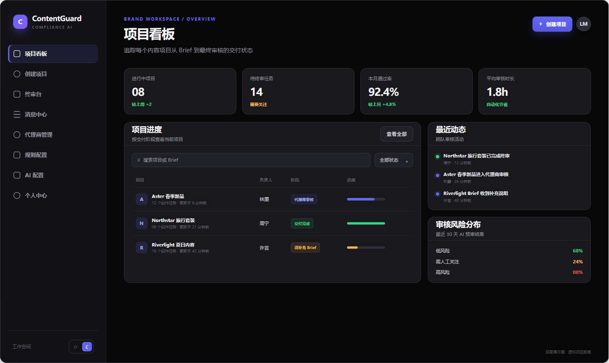
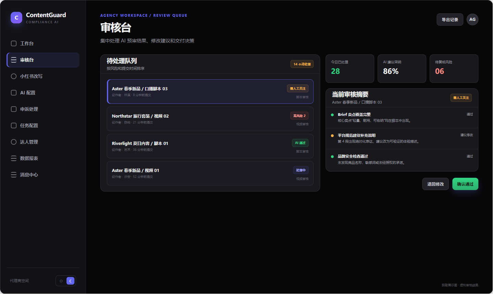
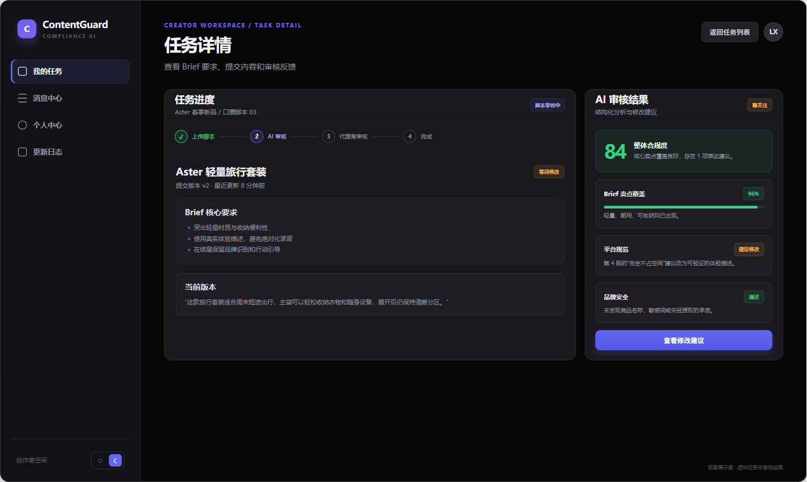
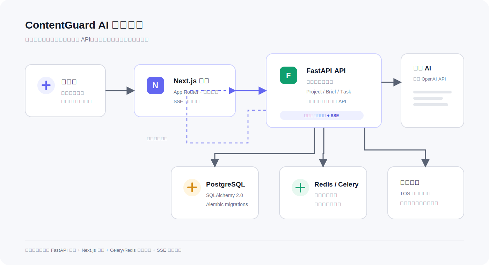

# ContentGuard AI

## 内容卫士 AI 审核平台

ContentGuard AI 是一个面向品牌内容团队、代理商和创作者的营销内容合规审核工作台。平台将 Brief、品牌规则、脚本、视频、AI 预审和人工复核串成一条可追踪的内容交付流程。

> 本仓库是用于个人作品集展示的独立改编版本。生产凭据、真实业务数据、私有域名、公司标识和部署访问信息均未包含在仓库中。

## 产品界面（脱敏展示）

以下展示图使用虚构项目、任务和审核结果生成，仅用于展示当前产品形态，不代表生产数据。

<table>
  <tr>
    <td align="center" width="33%">
      
      <br /><sub>品牌方项目看板</sub>
    </td>
    <td align="center" width="33%">
      
      <br /><sub>代理商审核工作台</sub>
    </td>
    <td align="center" width="33%">
      
      <br /><sub>创作者任务审核</sub>
    </td>
  </tr>
</table>

## 案例叙事

### 问题

品牌方、代理商和创作者共同参与内容交付时，Brief、版本、审核意见和最终决策容易分散在不同工具中，导致状态不清晰、反馈难追踪和重复沟通。

### 方案

以 `Project -> Brief -> Task` 为主线，把脚本上传、脚本 AI 审核、代理商审核、品牌方终审、视频上传和视频 AI 审核串成可追踪流程。每个阶段都保留状态、反馈和人工决策，创作者可以基于明确的修改建议重新提交。

### 关键取舍

- AI 输出结构化分析、风险项和修改建议，但不替代具备权限的人工决策。
- 视频、音频和关键帧处理通过 Celery/Redis 执行，前端通过 SSE 接收进度，避免长任务阻塞交互。
- 权限和 AI 配置按租户隔离，品牌方、代理商、创作者和运营人员看到不同的工作空间。

## 核心流程

```text
Project 项目
    -> Brief 内容 Brief
    -> Task 创作任务
    -> 脚本上传
    -> 脚本 AI 审核
    -> 代理商审核
    -> 品牌方终审（可选）
    -> 视频上传
    -> 视频 AI 审核
    -> 代理商审核
    -> 品牌方终审（可选）
    -> 完成
```

平台保留脚本和视频两套独立审核阶段。脚本被驳回时回到脚本上传，视频被驳回时回到视频上传。AI 负责提供结构化分析和建议，最终决策仍由具备权限的人工角色完成。

## 角色模型

| 角色 | 主要职责 |
| --- | --- |
| 品牌方 | 创建项目、维护 Brief 和规则、管理代理商、执行最终审核 |
| 代理商 | 管理创作者、创建任务、处理 AI 结果、协调内容交付 |
| 创作者 | 上传脚本和视频、查看反馈、提交申诉 |
| 运营人员 | 在独立工作空间中管理项目、任务、规则、AI 配置和小红书批次 |

认证由 Logto 负责，后端验证 Logto JWT 的签名、issuer 和 audience。租户上下文由后端统一解析，并用于隔离项目、任务、规则、AI 配置和小红书工作台数据。

## AI 审核流水线

### 脚本审核

脚本审核会结合项目 Brief、平台规则、禁用词、竞品信息和品牌学习规则，输出结构化结果，包括：

- 法律合规
- 平台规范
- 品牌安全
- Brief 卖点覆盖
- 内容质量
- 品牌露出
- 违规项和修改建议

### 视频审核

视频审核会下载提交文件，提取音频和关键帧，执行 ASR、OCR、画面分析和多模态判断，再合并为结构化审核报告。耗时任务可以通过 Celery 和 Redis 执行，处理进度通过 SSE 推送到前端。

## 小红书批量改写

代理商和运营工作台包含独立的小红书批量内容改写流程：

```text
小红书项目
    -> 内容变体
    -> 改写方向
    -> 版本化规则包
    -> 试运行或完整批次
    -> AI 改写
    -> AI 校验
    -> 重试 / 安全改写 / 人工决策
    -> Markdown 或飞书文档导出
```

每条内容都会记录原文、模型信息、校验结果、重试状态、最终文案和导出记录。

## 技术架构



```text
浏览器
  -> Nginx
      -> Next.js 前端
          -> FastAPI API
              -> PostgreSQL / Alembic
              -> Redis / Celery
              -> TOS 或本地文件存储
              -> 兼容 OpenAI API 的 AI 服务
```

当前实现是单体 FastAPI 后端加 Celery worker 的架构，不把规划中的微服务、向量检索或 WebSocket 能力描述为已交付功能。

## 技术栈

- 前端：Next.js 14、React、TypeScript、TailwindCSS、Vitest
- 后端：FastAPI、SQLAlchemy 2.0、Pydantic、Alembic、pytest
- 数据与异步：PostgreSQL、Redis、Celery
- 认证：Logto
- 文件：TOS 兼容对象存储，支持本地开发回退
- 部署：Docker Compose、Nginx、可选 Drone/GitLab CI 模板

## 项目目录

```text
backend/       FastAPI API、数据模型、服务、Celery 任务、迁移和测试
frontend/      Next.js App Router 应用和 Vitest 测试
docs/          用户、部署、功能和 CI/CD 文档
featuredoc/    历史需求、设计和测试规划文档
nginx/         反向代理配置
scripts/       本地开发、备份和部署脚本
```

## 本地开发

环境要求：

- Python 3.11+
- Node.js 18+
- PostgreSQL 16+
- Redis 7+
- Docker Desktop（可选）

复制环境模板：

```powershell
Copy-Item .env.example .env
Copy-Item backend/.env.example backend/.env
```

安装并运行后端：

```powershell
Set-Location backend
uv sync --extra dev
uv run alembic upgrade head
uv run pytest -q
```

运行前端：

```powershell
Set-Location frontend
npm ci
npm run dev
```

也可以使用 Docker Compose：

```powershell
docker compose config --quiet
docker compose up -d --build
```

完整环境需要外部 Logto、PostgreSQL、Redis、AI 服务和对象存储配置。真实配置只能放在本地环境或 CI/CD Secret 中，不能提交到 Git。

## 配置与密钥

常用配置包括：

- `LOGTO_ENDPOINT`、`LOGTO_APP_ID`、`LOGTO_APP_SECRET`、`LOGTO_COOKIE_SECRET`
- `LOGTO_API_RESOURCE`、`SECRET_KEY`、`OPERATOR_ACCESS_CODE`
- `DATABASE_URL`、`REDIS_URL`
- `AI_PROVIDER`、`AI_API_KEY`、`AI_API_BASE_URL`
- `TOS_ACCESS_KEY_ID`、`TOS_SECRET_ACCESS_KEY`、`TOS_BUCKET_NAME`

运营角色的 `OPERATOR_ACCESS_CODE` 默认为空。未显式配置时，运营人员 onboarding 会被拒绝，这是公开环境的安全默认行为。

## 当前验证

- 后端目标测试：142/142 通过
- 后端完整测试：518 通过，2 个 Celery worker 用例在全量顺序下存在环境敏感超时，隔离运行通过
- 前端身份相关测试：45/45 通过
- 前端完整 Vitest：28 个测试文件、403/403 通过
- 前端 lint、TypeScript 类型检查和生产构建：通过，lint/build 保留 5 个既有 `no-img-element` 警告
- GitHub Actions 质量门禁：`main` push、面向 `main` 的 Pull Request 和手动触发会并行执行前端完整检查与后端稳定测试；真实 Celery、容器依赖的 integration/e2e 测试暂作为独立手动边界，待环境敏感超时和依赖条件解决后再纳入快速门禁
- 作品集展示资产：3 张脱敏界面图和 1 张当前架构图已加入 README
- 公开信息扫描：无旧项目标识、私有 IP 和明文密钥

详细记录见 [ECC_AUDIT_REPORT.md](ECC_AUDIT_REPORT.md)。

## 当前范围与限制

- AI 审核质量取决于配置的模型服务和 Brief/规则数据质量。
- 本地开发可以使用 asyncio 回退，生产环境建议运行 Celery worker。
- Logto、AI、TOS、PostgreSQL 和 Redis 是外部依赖，不包含在公开仓库中。
- 历史规划文档可能包含早期方案，当前行为以源码、测试和本 README 为准。
- 本项目用于展示产品建模、权限边界、异步媒体处理和人机协同审核设计，不提供开箱即用的生产账号或生产数据。

## 作品集说明

项目地址：[github.com/PLKJ666/contentguard-ai](https://github.com/PLKJ666/contentguard-ai)

本项目重点展示：

- 多角色内容交付流程设计
- Project、Brief、Task 领域模型
- 租户级 AI 配置和权限隔离
- 脚本与视频的分阶段审核状态机
- Celery/Redis 异步任务和 SSE 实时进度
- 人工复核、申诉、强制通过和审计日志
- 小红书批量改写、校验、重试和导出能力
